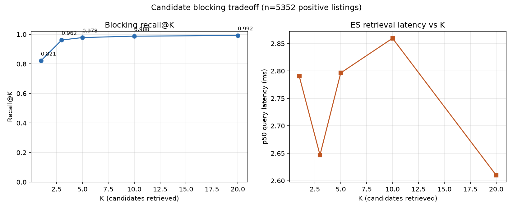

# Phase 2 — Candidate Blocking (Elasticsearch)

## Setup

- Single-node Elasticsearch 8.15 via `docker-compose` ([`docker-compose.yml`](../docker-compose.yml)).
- Indexed the 1,338-event indexed catalog slice from Phase 1 ([`blocking/index_catalog.py`](../blocking/index_catalog.py)).
- Per-listing candidate retrieval ([`blocking/retrieve.py`](../blocking/retrieve.py)): fuzzy `match` on team-name
  text (`fuzziness: AUTO`), a secondary fuzzy `match` on venue name (boosted lower), and a `±3 day` date range
  `filter` when the listing's date has an unambiguous year — normalization ([`blocking/normalize.py`](../blocking/normalize.py))
  deliberately skips the date filter rather than guess a year, since a wrong guess would silently drop the true
  candidate.
- Recall@K measured over all **5,352 positive listings** from Phase 1 (listings with a real target event; `NO_MATCH`
  listings have no target to measure retrieval recall against by definition). See [`blocking/eval_recall.py`](../blocking/eval_recall.py).

## Headline result: recall@K

| K | Recall@K |
|---|---|
| 1 | 0.821 |
| 3 | 0.962 |
| 5 | 0.978 |
| 10 | 0.988 |
| 20 | 0.992 |

42 / 5,352 (0.8%) positive listings never surface the true event even at K=20 — see "known limitation" below.

## Finding: abbreviation-only titles were the dominant recall bottleneck

The first pass (fuzzy match on full team names only) landed at **recall@1 = 0.651, recall@20 = 0.870**, with
698/5,352 (13%) never retrieved at all. Sampling 300 misses showed the large majority were abbreviation-only
titles like `"DAL @ ATL"` or `"IND sv MIN"` — edit-distance fuzzy matching can't bridge `"dal"` to
`"dallas mavericks"`, since that's not a typo relationship, it's a different string entirely.

Fix: index each event's known team abbreviation (`data/team_abbreviations.py`, shared with the noise generator so
there's no duplicate mapping) as an extra token in `search_text`, alongside the full names — not a replacement.
After reindexing: **recall@1 = 0.821, recall@20 = 0.992**, never-retrieved dropped from 698 to 42. This is a
blocking-stage fix only (no ML involved) and is reflected in the numbers above.

## Remaining 42 misses (spot-checked)

The residual gap is dominated by compounding noise — e.g. an abbreviation *and* a character-level typo landing on
an abbreviation that collides with nothing indexed (`"YK vs SS"` for a mangled `NYK`/`BKN`), or a title with both
venue and any year context stripped. These are exactly the cases the ranker/agentic tiers exist for; blocking
isn't expected to be perfect, and 99.2% recall@20 vs. indexing the full 1,338-event catalog for every listing is
the tradeoff this phase is meant to surface.

## Latency

At this catalog size (1,338 docs, single-node, localhost), retrieval is cheap and essentially flat across
K — p50 stays in the 2.6-2.9ms band regardless of K (see right panel above); overall p50/p95/p99 = 2.92 / 5.02 /
8.29 ms. The K-vs-latency tradeoff the PRD asks about would show up at production scale (millions of documents,
network hop to ES, not a single warm local node) rather than here — at 1,338 documents, ES ranks the full index
internally regardless of requested `size`, so there's no meaningful marginal cost to K in this deployment.
