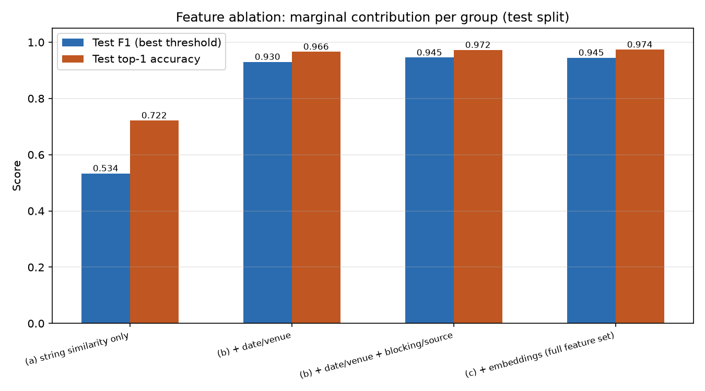

# Phase 4 — LightGBM Ranker + Feature Ablation

## Model

Pointwise binary LightGBM classifier (PRD 6.4: "implement pointwise first,
simpler, easier to calibrate a threshold") on the 25-feature
`features/full_feature_set.csv` from Phase 3. `scale_pos_weight` set to the
train-split class ratio (label is ~5.3% positive at the pair level, since
each listing has ~1 true match among ~19 blocking candidates on average).
Early-stopped on `val` binary logloss. See [`model/train_lightgbm.py`](../model/train_lightgbm.py).

**Split**: inherited from Phase 1/3's per-event split (train/val/test =
70,949 / 15,160 / 14,935 pairs). Verified by construction, not just
assumption — `features/build_pairs.py` assigns split per *listing*
(positive listings inherit their true event's split; `NO_MATCH` listings
get a deterministic hash-based split), and every pair from a given listing
carries that one split value. No event's listings appear in more than one
split.

## Full model results

| Split | Metric | Value |
|---|---|---|
| val | F1 @ threshold 0.5 | 0.931 |
| val | F1 @ best threshold (0.970) | 0.949 |
| val | top-1 accuracy (per listing) | 0.966 (n=797) |
| test | F1 @ threshold 0.5 | 0.921 |
| test | F1 @ best threshold (0.936) | 0.943 |
| test | average precision | 0.990 |
| test | top-1 accuracy (per listing) | 0.971 (n=798) |

Top-1 accuracy = for each test listing with a true match among its blocking
candidates, does the ranker's highest-scored candidate equal the true
match? This is the metric closest to "does the pipeline get it right,"
and it's bounded above by Phase 2's blocking recall (0.821 @ K=1, 0.992 @
K=20) — 798 is the count of test listings whose true match survived
blocking at all.

## Feature ablation (the headline artifact)

| Stage | Features | Test F1 (best thr.) | Test top-1 acc. |
|---|---|---|---|
| (a) string similarity only | 8 | 0.534 | 0.722 |
| (b) + date/venue | 19 | 0.930 | 0.966 |
| (b) + blocking score/source | 24 | 0.945 | 0.972 |
| (c) + embeddings (full set) | 25 | 0.945 | 0.974 |

**Reading it**: string similarity alone gets a LightGBM model to F1=0.534
— already ahead of the plain logistic-regression baseline on the same
features (F1=0.441, [Phase 3a](phase3a_string_features.md)), which makes
sense since GBTs capture nonlinear interactions LR can't. Adding date
proximity and venue match is by far the single biggest jump: **+0.40 F1**.
This tracks the top-feature-importance list from the full model
(`date_day_diff` and `venue_geo_distance_km` are the two highest-gain
features by a wide margin) — once blocking has narrowed candidates to
~20 plausible ones, string similarity on team names often can't
distinguish "right teams wrong date" from "right teams right date," but
date/venue trivially can.

**The embeddings finding**: adding the sentence-transformer cosine
similarity feature on top of everything else moves test F1 from 0.945 to
0.945 (top-1 accuracy +0.002) — i.e. **essentially nothing**, despite
embeddings alone scoring a respectable F1=0.476 standalone
([Phase 3b](phase3b_embeddings.md)). The signal embeddings carry (rough
semantic/textual similarity between listing and candidate) is almost
entirely redundant with what string-similarity + date/venue already
capture once the model can combine them nonlinearly — embeddings aren't
*wrong* here, they're just not adding information the other features
don't already provide for this task. This is a real, somewhat
counterintuitive result worth calling out rather than hiding: bigger/
fancier features don't automatically help a ranker that already has
strong structured signal (a well-known finding in a lot of production
"tabular vs. embeddings" comparisons, being reproduced here on synthetic
but realistically-generated data).

## Latency (auto-accept path, blocking + features + inference)

Deferred to [Phase 7](phase7_writeup.md)'s full latency write-up, which
covers the whole path end-to-end rather than model inference alone.
